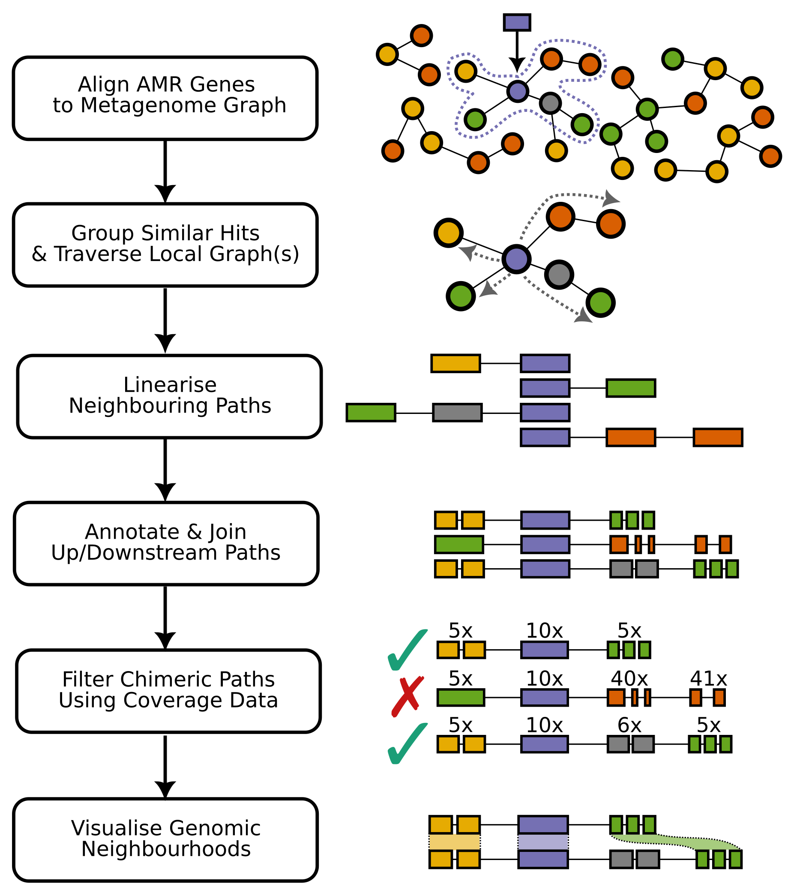

# Sarand


Sarand is a tool to identify genes within an assembly graph and extract the local graph neighbourhood.
It has primarily been developed for the analysis of Antimicrobial Resistance (AMR) genes within metagenomic assembly graphs.
[CARD](card.mcmaster.ca) database is the default set of genes used for which neighborhoods are found but Sarand can support any user-supplied nucleotide fasta file of target genes.
<!--- Currently this is fixed to using the [CARD](card.mcmaster.ca) database but will be expanded in the near future to support any user-supplied nucleotide fasta file of target genes.-->




## Installation

Sarand requires 4 key dependencies:

- [Prokka](https://github.com/tseemann/prokka)
- [RGI](https://github.com/arpcard/rgi)
- [BLAST+](https://blast.ncbi.nlm.nih.gov/Blast.cgi?PAGE_TYPE=BlastDocs&DOC_TYPE=Download)
- [Bandage](https://rrwick.github.io/Bandage/)

These can be installed using bioconda.

1. Clone and enter the sarand repository: `git clone https://github.com/beiko-lab/sarand; cd sarand`

2. Install conda and configure the bioconda channel (detailed instructions can be found [here](https://bioconda.github.io)).

3. As there are dependency conflicts between the tools used by sarand, you will need to create multiple conda environments.

**Creating environments:**

```shell
# 1. Create the sarand environment
conda create -n sarand -c conda-forge -c bioconda -c defaults -y blast=2.14.0 dna_features_viewer=3.1.2 numpy matplotlib-base gfapy=1.2.3 pandas python pillow biopython

# 2. Create the Prokka environment
conda create -n prokka-1.14.6 -c conda-forge -c bioconda -c defaults -y prokka=1.14.6

# 3. Create the Bandage environment
conda create -n bandage-0.8.1 -c conda-forge -c bioconda -c defaults -y bandage=0.8.1

# 4. Create the RGI environment
conda create -n rgi-5.2.0 -c conda-forge -c bioconda -c defaults -y rgi=5.2.0
```

4. Activate the environment: `conda activate sarand`

5. Install the sarand package into this environment `pip install .`

### Testing

You can test your install has worked by running the test script via `bash test/test.sh` 
This will execute sarand on a test dataset (using the following command) and check all the expected outputs are created correctly.

    `sarand -i test/spade_output/assembly_graph_with_scaffolds.gfa -o test/test_output -a metaspades -k 55`


## Usage

All of sarand's parameters can be set using the command line flags.
The only required input file is an assembly graph in `.gfa` format.

This can be generated using metagenomic (or genomic) de-novo assembly tools
such as [metaSPAdes](https://github.com/ablab/spades) or [megahit](https://github.com/voutcn/megahit).
If your chosen assembly tool generates a `fastg` formatted graph utilities such as `fastg2gfa` can be used to convert them.

```
usage: sarand [-h] [-v] -i INPUT_GFA -a ASSEMBLER
              -k MAX_KMER_SIZE [-j NUM_CORES] [-c COVERAGE_DIFFERENCE]
              [-t TARGET_GENES] [-x MIN_TARGET_IDENTITY]
              [-l NEIGHBOURHOOD_LENGTH] [-o OUTPUT_DIR] [-f]
              [--no_rgi | --rgi_include_loose]

Identify and extract the local neighbourhood of target genes (such as AMR)
from a GFA formatted assembly graph

optional arguments:
  -h, --help            show this help message and exit
  -v, --version         show program's version number and exit
  -i INPUT_GFA, --input_gfa INPUT_GFA
                        Path to assembly graph (in GFA format) that you wish
                        to analyse
  -a ASSEMBLER, --assembler ASSEMBLER
                        Assembler used to generate input GFA (required to correctly parse coverage information). It can be one of the following options: metaspades, bcalm and megahit
  -k MAX_KMER_SIZE, --max_kmer_size MAX_KMER_SIZE
                        The (maximum) k-mer sized used by assembler to generate input GFA
  -j NUM_CORES, --num_cores NUM_CORES
                        Number of cores to use
  -c COVERAGE_DIFFERENCE, --coverage_difference COVERAGE_DIFFERENCE
                        Maximum coverage difference to include when filtering
                        graph neighbourhood. Use -1 to indicate no coverage
                        threshold (although this will likely lead to false
                        positive neighbourhoods).
  -t TARGET_GENES, --target_genes TARGET_GENES
                        Target genes to search for in the assembly graph
                        (fasta formatted). Default is the pre-installed CARD
                        database
  -x MIN_TARGET_IDENTITY, --min_target_identity MIN_TARGET_IDENTITY
                        Minimum identity/coverage to identify presence of
                        target gene in assembly graph
  -l NEIGHBOURHOOD_LENGTH, --neighbourhood_length NEIGHBOURHOOD_LENGTH
                        Size of gene neighbourhood (in terms of nucleotides) to extract from the
                        assembly graph
  -o OUTPUT_DIR, --output_dir OUTPUT_DIR
                        Output folder for current run of sarand
  -f, --force           Force overwrite any previous files/output directories
  --no_rgi              Disable RGI based annotation of graph neighbourhoods
  --rgi_include_loose   Include loose criteria hits if using RGI to annotate graph neighbourhoods
  --extraction_timeout  Maximum time to extract neighbourhood sequences of a given gene with default value being -1 indicating no limit
```

### Output
All results will be available in specified output directory (default is `sarand_results_` followed by a timestamp).
Here is the list of important directories and files that can be seen there and a short description of their content:
* `AMR_info`: this directory contains the list of identified AMR sequences.
    * `AMR_info/sequences/`:The sequence of identified AMRs, from graph, is stored here, with a name similar to their original name (file name is generated by calling `sarand/utils.py::restricted_amr_name_from_modified_name(amr_name_from_title(amr_original_name)))`
    * `AMR_info/alignments/`: The alignment details for all AMR sequences are stored here.

* `sequences_info/sequences_info_{neighbourhood_length}/`: This directory stores the information of extracted neighborhood sequences from the assembly graph.
    * `sequences_info/sequences_info_{params.neighbourhood_length}/sequences/`: the extracted sequences in the neighborhood of each AMR are stored in a file like `ng_sequences_{AMR_NAME}_{params.neighbourhood_length}_{DATE}.txt`.
For each extracted sequence, the first line denotes the corresponding path, where the nodes representing the AMR sequence are placed in '[]'. The next line denotes the extracted sequence where the AMR sequence is in lower case letters and the neighborhood is in upper case letters.
    * `sequences_info/sequences_info_{params.neighbourhood_length}/paths_info/`: The information of nodes representing the AMR neighborhood including their name, the part of the sequence represented by each node (start position and end position) as well as their coverage is stored in a file like `ng_sequences_{AMR_NAME}_{params.neighbourhood_length}_{DATE}.csv`

* `annotations/annotations_{params.neighbourhood_length}`: The annotation details are stored in this directory.
    * `annotations/annotations_{params.neighbourhood_length}/annotation_{AMR_NAME}_{params.neighbourhood_length}`: this directory contains all annotation details for a given AMR.
    * `gene_comparison_<AMR_NAME>.png`: An image visualizing annotations
    * `annotation_detail_{AMR_NAME}.csv`: the list of annotations of all extracted sequences for an AMR gene
    * `trimmed_annotation_info_{AMR_NAME}.csv`: the list of unique annotations of all extracted sequences for an AMR gene
    * `coverage_annotation_{COVERAGE_DIFFERENCE}_{AMR_NAME}.csv`: the list of the annotations in which the gene coverage difference from the AMR gene coverage is less than GENE_COVERAGE_DIFFERENCE value.
    * `prokka_dir_extracted{NUM}_{DATE}`: it contains the output of prokka for annotation of a sequence extracted from the neighborhood of the target AMR gene in the assembly graph.
    * `rgi_dir`: contains RGI annotation details for all extracted neighborhood sequences of the target AMR gene.
